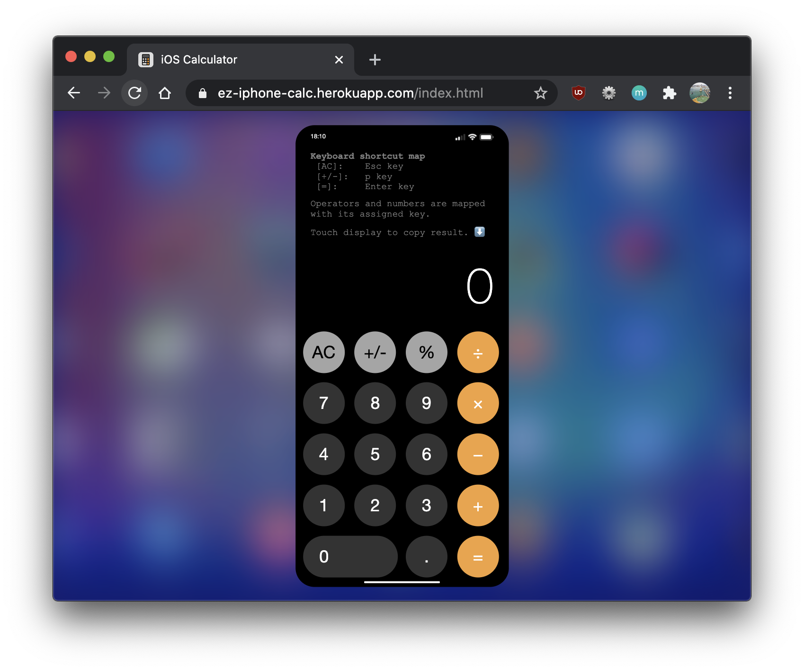
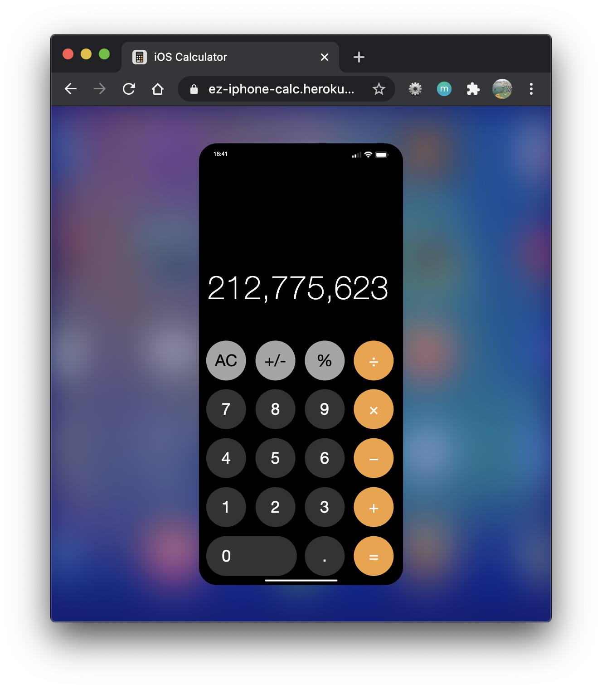
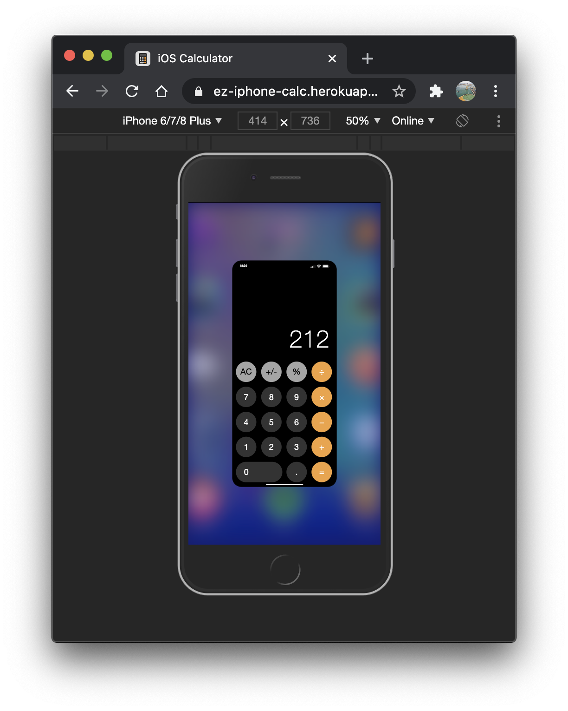

# iOS Calculator
Do the math with the iOS Calculator! The Calculator App runs in your favorite browser and includes keyboard compatibility. It was developed with the ES6 Vanilla Javascript and OOP paradigm.

It's compatible on Mobile and Desktop.

**Tools:**
- CSS
- HTML
- ES6 JavaScript

## Contributing
Pull requests are welcome. For major changes, please open an issue first to discuss what you would like to change.

Please make sure to update tests as appropriate.

## License
[MIT](LICENSE)